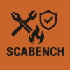

# Ian Tozer

**Web3 Security & Full Stack Development**

### Brands & Projects I have worked with
| | | | |
| :---: | :---: | :---: | :---: |
|  |  |  |  |
|  |  |  |  |

### Programming Languages
Solidity, JavaScript, Python, Rust, Golang, and more.

Aspiring mathematician.

### Audit Process

> [!TIP]
> **My process helps me find vulnerabilities that elite audit firms miss.**
>
> Learn about my unique workflow in my [audit process](pages/audit-process.md) page.

### Socials
- [X](https://x.com/i_tozer)
- [SubStack](https://substack.com/@iantozer)

### Audits
| Client | Scope | Engagement | Findings | Report |
| :--- | :--- | :--- | :--- | :---: |
| **Aragon** | VE Governance | Review | Boundary Conditions | [Link](https://gist.github.com/i-tozer/699fd773d754ee0c52260f8ebce04c5c) |
| **Aragon** | VE Governance | Audit #2 | 2 Low, 8 Info | [Link](https://gist.github.com/i-tozer/acdc8af6015c3d6daaf4150c7d799164) |
| **Aragon** | VE Governance | Audit | 2 High, 2 Med, 21 Info | [Link](https://gist.github.com/i-tozer/deff978ab2364e6874733ae419e7ce72) |
| **BerryBlock** | Swaptor | Audit | 1 High, 1 Med, 1 Low | [Link](https://gist.github.com/i-tozer/7efd4c174c0853f1ef19f987ca387741) |
| **Coral.li** | ERC1155 | Audit | - | Private |

### Competitions
- [Olas (1H/1M) | 4th Place](https://code4rena.com/audits/2023-12-olas)
- Total: 3H/5M

#### Development
- [Hound](https://github.com/scabench-org/hound) | Open Source Project
- [EHS | Project](link) | ETL Project
- [Solana Foundation | Grant](link) | Web3 Geography | Details
- [Aave Grants DAO | Grant](link) | UX Redesign | Details
- [Stakehodler](link) | Founder | DAO Governance Platform | Details

### Personal
Coming soon.
